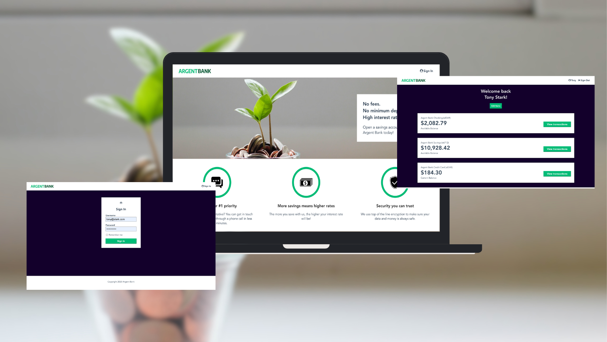

# ArgentBank Project

## Description

This is the 13th project of the Front-end Developer path at OpenClassrooms. The goal was to create a banking application with React and Redux.

You can connect to the application with the following credentials:
- email: tony@stark.com
- password: password123

You can change the informations of the profil on click on the button "Edit profil" on the profil page.



## Installation
You have to install the backend of the application. 
You can find it here: https://github.com/jucroizer/Project-13-Bank-API

Then, you have to install the frontend of the application. Follow the instructions below:
```bash
git clone https://github.com/jucroizer/croizer_justine_13_01042023.git
npm install
npm start
```

## Technologies
- React
- Redux
- React Router

Visual Studio Code was used to develop this project.


